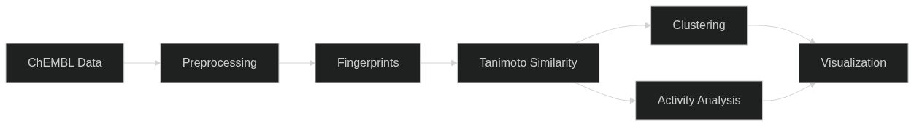

<p align="center">
  
</p>

TaniMol is a chemoinformatics project that analyzes the relationship between structural similarity and biological activity of DNA repair protein inhibitors. It takes bioactivity data from [ChEMBL](https://www.ebi.ac.uk/chembl/), encodes each molecule as a fingerprint, computes pairwise Tanimoto similarity, groups the compounds into clusters, and then examines how the activity (IC50) is distributed within and between those clusters.


> [!NOTE]
> **PRE-DEVELOPMENT — ARCHITECTURE & RESEARCH PHASE**
>
> This project currently exists as a collection of design documents and theoretical research.
> There is very little functional code at this stage. The repository is used to track architectural decisions, explore concepts, and lay the groundwork before implementation begins.

# Table of contents

- [Background](#background)
  - [DNA repair proteins as drug targets](#dna-repair-proteins-as-drug-targets)
  - [What is structure-activity analysis](#what-is-structure-activity-analysis)
  - [Why Tanimoto similarity](#why-tanimoto-similarity)
- [How the pipeline works](#how-the-pipeline-works)
  - [Data acquisition](#1-data-acquisition)
  - [Preprocessing](#2-preprocessing)
  - [Fingerprint generation](#3-fingerprint-generation)
  - [Similarity matrix](#4-similarity-matrix)
  - [Clustering](#5-clustering)
  - [Activity analysis](#6-activity-analysis)
  - [Visualization](#7-visualization)
- [Scope and focus](#scope-and-focus)
  - [A general pipeline with a specific purpose](#a-general-pipeline-with-a-specific-purpose)
  - [Why DNA repair](#why-dna-repair)
- [Project structure](#project-structure)
- [Installation](#installation)
- [Usage](#usage)
- [License](#license)

# Background

### DNA repair proteins as drug targets

Cells have specialized proteins that fix DNA damage. Tumors often depend on specific repair pathways to survive, which makes those proteins useful drug targets. The most well-known example is PARP1 - its inhibitors (olaparib, niraparib, etc.) are already approved drugs. Other targets from the same area include PARP2, ATR, ATM, and DNA-PKcs. Each of these has dozens to hundreds of known inhibitors with measured activity stored in public databases like ChEMBL.

This project takes those inhibitor collections and analyzes them from a structural perspective.

### What is structure-activity analysis

The basic idea is simple: take a set of molecules that have been tested against the same protein, and check whether the ones that look alike (structurally) also behave alike (in terms of potency).

In practice, the relationship between structure and activity is not always straightforward. Sometimes two molecules differ by a single atom yet show completely different potencies. These cases are called **activity cliffs** and they are the most interesting part of the analysis, because they point to structural features that strongly influence biological activity.

The opposite is also informative: when a whole cluster of structurally similar molecules has consistently high (or low) activity, that cluster likely represents a coherent chemical series worth further investigation.

### Why Tanimoto similarity

There are many ways to compare molecules. TaniMol uses the **Tanimoto coefficient** applied to binary fingerprints, because it's the standard approach in chemoinformatics for this type of analysis. It has clear advantages:

- It's well-understood and widely used in the field
- It works with any binary fingerprint type (Morgan, MACCS, etc.)
- It produces values between 0 and 1, which are easy to interpret
- It handles the "asymmetry problem" - if molecule A has 10 features and B has 100, their similarity is low even if all of A's features are present in B

The formula itself is straightforward:

$$T(A, B) = \frac{c}{a + b - c}$$

Where _a_ and _b_ are the number of "on" bits in each fingerprint, and _c_ is the number of bits that are "on" in both. When two molecules have identical fingerprints, T = 1. When they share nothing, T = 0.

# How the pipeline works



### 1. Data acquisition

Bioactivity data comes from [ChEMBL](https://www.ebi.ac.uk/chembl/), a public database of bioactive molecules maintained by the European Bioinformatics Institute. The ChEMBL API only allows paginated access to individual records, so instead of querying it record by record, the project downloads the full ChEMBL SQLite database dump from the [EBI FTP server](https://ftp.ebi.ac.uk/pub/databases/chembl/ChEMBLdb/latest/).

The `scripts/fetch_data.py` script handles this automatically — it downloads the archive, extracts the `.db` file into `data/raw/`, and cleans up temporary files. Once the database is local, all subsequent filtering and querying is done offline using SQL, which is both faster and more reliable than API calls.

### 2. Preprocessing

Raw ChEMBL data needs cleaning before analysis:

- **SMILES validation** - invalid or unparseable structures are removed (using RDKit)
- **Salt stripping** - counter-ions and solvents are removed, keeping only the active molecule
- **Tautomer standardization** - different representations of the same molecule are unified
- **Duplicate handling** - when the same molecule appears multiple times for the same target, the entry with the lowest (best) IC50 is kept
- **pIC50 conversion** - IC50 values in nM are converted to pIC50 = −log₁₀(IC50 × 10⁻⁹), so that higher values = higher potency and the scale is more uniform

After this step, each row in the dataset is one unique molecule with a clean SMILES string, a target label, and a pIC50 value.

### 3. Fingerprint generation

Each molecule is converted into a binary fingerprint - a fixed-length vector of 0s and 1s where each bit represents the presence or absence of a particular substructural feature.

The primary fingerprint type is **Morgan (ECFP4)** with radius 2 and 2048 bits. This captures circular neighborhoods around each atom up to 2 bonds away. It's the same fingerprint type used in most virtual screening and similarity-based analyses in drug discovery.

The code also supports MACCS Keys (166 predefined structural patterns) and RDKit topological fingerprints as alternatives, since different fingerprint types can give different similarity rankings. Comparing results across fingerprint types is part of the analysis.

### 4. Similarity matrix

Once all molecules have fingerprints, a pairwise Tanimoto similarity matrix is computed. For a dataset of N molecules, this is an N×N symmetric matrix where entry (i, j) is the Tanimoto coefficient between molecules i and j. The diagonal is always 1.0 (a molecule is identical to itself).

For efficiency, the computation uses RDKit's `BulkTanimotoSimilarity`, which is implemented in C++ and much faster than computing each pair individually in Python.

The **distance matrix** (1 − Tanimoto) is also computed, since most clustering algorithms work with distances rather than similarities.

### 5. Clustering

Molecules are grouped into clusters based on structural similarity. The primary method is **Butina clustering** (also called sphere-exclusion clustering):

1. For each molecule, count how many neighbors it has within a distance threshold (e.g. Tanimoto distance < 0.4)
2. The molecule with the most neighbors becomes the centroid of the first cluster, and its neighbors join that cluster
3. Repeat with the remaining molecules
4. Molecules with no neighbors become singletons

A key advantage of Butina over methods like K-Means is that you don't need to specify the number of clusters in advance. The threshold parameter controls cluster granularity instead.

**Hierarchical clustering** (using scipy's linkage) is applied as a second method for comparison. It produces a dendrogram showing the relationships between all molecules, which is useful for visual inspection even when Butina is the primary method.

### 6. Activity analysis

This is the core analytical step - checking whether structural clusters correspond to activity groups. Several analyses are performed:

**Within-cluster activity distributions**: For each cluster, compute the mean, median, standard deviation, and range of pIC50 values. Clusters where all members have similar activity support the "similar structure → similar activity" hypothesis. Clusters with high variance suggest the relationship breaks down.

**Activity cliff detection**: Find pairs of molecules where Tanimoto similarity is high (e.g. > 0.8) but the difference in pIC50 is large (e.g. > 2 units, which means a 100-fold difference in potency). These pairs are activity cliffs.

**SALI (Structure-Activity Landscape Index)**: For each pair of molecules, SALI = |ΔpIC50| / (1 − Tanimoto). This amplifies cases where very similar molecules have very different activities. High SALI values point to the most dramatic activity cliffs.

**Similarity-activity correlation**: Overall statistical test (Spearman correlation) between pairwise Tanimoto similarity and pairwise |ΔpIC50|. A strong negative correlation would mean similar molecules do tend to have similar activity.

### 7. Visualization

The results are presented through several types of plots:

- **Chemical space map** - t-SNE or UMAP projection of fingerprints into 2D, with points colored by target or by pIC50
- **Similarity heatmap** - the full Tanimoto matrix displayed as a heatmap, optionally with hierarchical clustering dendrogram
- **Cluster activity boxplots** - distribution of pIC50 within each cluster, making it easy to spot active vs. inactive clusters
- **Activity cliff scatter** - Tanimoto similarity vs. |ΔpIC50| for all molecule pairs, highlighting activity cliffs
- **SALI network** - graph where nodes are molecules and edges connect pairs with high SALI scores

# Scope and focus

### A general pipeline with a specific purpose

The core of TaniMol — fetching data from ChEMBL, generating fingerprints, computing Tanimoto similarity, clustering, and detecting activity cliffs — is **target-agnostic**. It works with any set of molecules and any bioactivity endpoint. If you wanted to analyze kinase inhibitors, GPCR ligands, or antibiotic candidates, you could use the same pipeline without modification. The only input that changes is which target you query from the database.

This makes TaniMol a reusable framework for structure-activity landscape analysis on any ChEMBL target.

### Why DNA repair

This project deliberately focuses on **DNA repair protein inhibitors** as its primary case study. I chose it because the DNA repair field has several properties that make it particularly well-suited for this kind of analysis:

- **Multiple related targets** — PARP1, PARP2, ATR, ATM, and DNA-PKcs are all part of the DNA damage response, but they belong to different repair pathways (BER, checkpoint signaling, NHEJ). This creates a natural framework for cross-target comparisons that wouldn't exist with a single isolated protein.
- **Clinical relevance** — PARP inhibitors (olaparib, niraparib, rucaparib, talazoparib) are already approved drugs for breast and ovarian cancer. ATR and DNA-PKcs inhibitors are in clinical trials. Analyzing these molecules can connect directly to real-world drug discovery and development.
- **Data availability** — these targets have well-populated bioactivity datasets in ChEMBL.

# Project structure

```
TaniMol/
├── data/
│   ├── raw/                 # Original ChEMBL database
│   ├── processed/           # Cleaned, merged dataset with pIC50
│   ├── external/            # Any third-party data
│   └── targets/             # Notes on selected DNA repair targets
│
├── src/                     # Python modules (importable from notebooks)
│   ├── config.py            # Shared configuration (targets, ChEMBL version, filters)
│   ├── fetch_data.py        # Download ChEMBL database from EBI FTP
│   ├── preprocessing.py     # Clean SMILES, compute pIC50, deduplicate
│   ├── fingerprints.py      # Generate Morgan/MACCS/RDKit fingerprints
│   ├── similarity.py        # Compute Tanimoto similarity and distance matrices
│   ├── clustering.py        # Butina and hierarchical clustering
│   ├── activity_analysis.py # Activity cliffs, SALI, correlation statistics
│   └── visualization.py     # All plotting functions
│
├── notebooks/
│   └── 01_analysis.ipynb    # Full analysis notebook with explanations and plots
│
├── results/                 # Generated plots, tables, exported figures
├── tests/                   # Unit tests for core modules
├── docs/img/                # Logo and README figures
├── requirements.txt         # Python dependencies
└── LICENSE                  # MIT
```

The `src/` modules are designed to be imported from the notebook:

```python
from src.preprocessing import load_and_clean
from src.fingerprints import generate_fingerprints
from src.similarity import tanimoto_matrix
```

Each module handles one step of the pipeline. Analysis parameters (fingerprint radius, clustering threshold, etc.) are defined at the top of the notebook so they're visible and easy to adjust.

# Installation

```bash
git clone https://github.com/stanuch/TaniMol.git
cd TaniMol
pip install -r requirements.txt
```

RDKit is the only dependency that can be tricky to install. If `pip install rdkit` doesn't work, the recommended approach is through conda:

```bash
conda install -c conda-forge rdkit
```

# Usage

The intended workflow is through the Jupyter notebook:

```bash
jupyter notebook notebooks/01_analysis.ipynb
```

The notebook runs the full pipeline step by step with explanations and generates all plots inline. All heavy computation is handled by the `src/` modules, so the notebook itself stays clean and focused on the analysis narrative.

To fetch fresh data from ChEMBL (requires internet):

```bash
python src/fetch_data.py
```

> **Note:** Before running, verify the ChEMBL version in `config.py` is up to date:
>
> ```python
> CHEMBL_VERSION = "36"  # change this to the desired version
> ```
>
> The latest version can be found at [ChEMBL Downloads](https://chembl.gitbook.io/chembl-interface-documentation/downloads).
> Alternatively, you can manually download the `chembl_XX_sqlite.tar.gz` file from the link above and place it in the `src/` folder. The script will extract and move the database file automatically. **Do not rename the downloaded file** — the script relies on ChEMBL's default naming convention (`chembl_XX_sqlite.tar.gz`) and will not recognize renamed files.
>
> **Requires:** SQLite3

# License

This project is licensed under the MIT License - see the [LICENSE](LICENSE) file for details.
