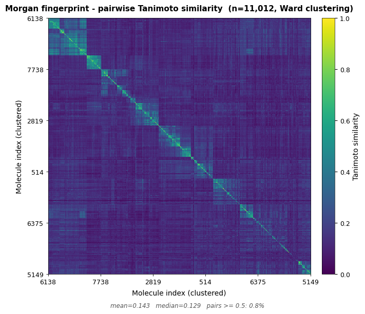

<p align="center">
  
</p>

TaniMol is an adaptable chemoinformatics pipeline built to map the relationship between structural similarity and biological activity. While developed and showcased using DNA repair protein inhibitors as a primary case study, it is designed to process bioactivity data for any defined pharmacological target. It extracts raw data from [ChEMBL](https://www.ebi.ac.uk/chembl/), encodes molecules into fingerprints, computes pairwise Tanimoto similarity matrices, groups compounds into chemical scaffolds via clustering, and analyzes the distribution of activity (e.g., pIC50) to detect hit scaffolds and activity cliffs.


> [!NOTE]
> **MID DEVELOPMENT — CLUSTERING COMPLETE**
>
> The pipeline acquires data, standardizes molecules, generates fingerprints (Morgan, MACCS, RDKit), computes Tanimoto similarity matrices, and groups compounds into clusters via Butina clustering. Cluster visualizations are in place. Next step is activity analysis (SALI, activity cliffs, SAR statistics).

# Table of contents

- [Background](#background)
  - [What is structure-activity analysis](#what-is-structure-activity-analysis)
  - [Molecular fingerprints](#molecular-fingerprints)
  - [Why Tanimoto similarity](#why-tanimoto-similarity)
  - [DNA repair proteins as drug targets](#dna-repair-proteins-as-drug-targets)
- [How the pipeline works](#how-the-pipeline-works)
  - [Data acquisition](#1-data-acquisition)
  - [Preprocessing](#2-preprocessing)
  - [Fingerprint generation](#3-fingerprint-generation)
  - [Similarity matrix](#4-similarity-matrix)
  - [Clustering](#5-clustering)
  - [Activity analysis](#6-activity-analysis)
  - [Visualization](#7-visualization)
- [Scope and focus](#scope-and-focus)
  - [A general pipeline with a specific purpose](#a-general-pipeline-with-a-specific-purpose)
  - [Why DNA repair](#why-dna-repair)
  - [Practical applications](#practical-applications)
- [Project structure](#project-structure)
- [Installation](#installation)
- [Usage](#usage)
- [Acknowledgements](#acknowledgements)
- [License](#license)

# Background

### What is structure-activity analysis

The basic idea is pretty simple. Take a set of molecules tested against the same protein and check whether the ones that look alike (structurally) also behave alike (in terms of potency).

In practice, the relationship between structure and activity isn't always straightforward. Sometimes two molecules differ by a single atom yet show completely different potencies. These cases, called **activity cliffs**, are a very important parts of the analysis because they point to structural features strongly influencing biological activity.

When a whole cluster of structurally similar molecules has consistently high (or low) activity, that cluster likely represents a coherent chemical series worth further investigation.

### Molecular fingerprints

To compare molecules computationally, their complex 2D graphed structures must be converted into a mathematical format. **Molecular fingerprints** achieve this by encoding structural features into a binary array (a sequence of 1s and 0s). 

If a specific feature (e.g., a benzene ring, a hydroxyl group, or a specific bond path) is present in the molecule, the corresponding bit in the fingerprint is set to 1. If it's absent, the bit remains 0.

There are different paradigms of fingerprints, depending on how they define these "features". Substructure keys (like MACCS Keys) rely on a predefined dictionary of structural patterns (e.g., "Is there an oxygen atom?", "Is there a 5-membered ring?"). They are interpretable but represent a broad, low-resolution view of the molecule. Topological & Circular fingerprints (like RDKit, Morgan/ECFP4) traverse the molecule's chemical graph systematically. Morgan fingerprints, the primary method used in this project, iterate outwardly up to a specific radius around each atom, recording the unique circular environments. These localized substructures are then mathematically hashed into a fixed-length binary array (typically 2048 bits). This provides an exceptionally granular representation of the molecule's true local topology.

These resulting arrays allow algorithms to rapidly compare thousands of molecules using efficient bitwise computer operations, forming the foundation of cheminformatics.

### Why Tanimoto similarity

There are many ways to compare molecules. The **Tanimoto coefficient** applied to binary fingerprints was chosen because it's the standard approach in chemoinformatics. 

It handles the "asymmetry problem" well - if molecule A has 10 features and B has 100, their similarity is low even if all of A's features are present in B.

$$T(A, B) = \frac{c}{a + b - c}$$

Where _a_ and _b_ are the number of "on" bits in each fingerprint, and _c_ is the number of bits that are "on" in both. When two molecules have identical fingerprints, T = 1. When they share nothing, T = 0.

### DNA repair proteins as drug targets

Cells rely on specialized proteins to fix DNA damage. Tumors often depend on specific repair pathways to survive, making those proteins useful drug targets. For example, PARP1 inhibitors (olaparib, niraparib, etc.) are already approved drugs. Other targets from the same area include PARP2, ATR, ATM, and DNA-PKcs. Each of these has dozens to hundreds of known inhibitors with measured activity stored in public databases like ChEMBL.

This project takes those inhibitor collections and analyzes them from a structural perspective.

# How the pipeline works


### 1. Data acquisition

Bioactivity data comes from [ChEMBL](https://www.ebi.ac.uk/chembl/). The ChEMBL API limits paginated access, so instead of querying it record by record, the pipeline downloads the full ChEMBL SQLite database dump from the [EBI FTP server](https://ftp.ebi.ac.uk/pub/databases/chembl/ChEMBLdb/latest/). 

The `scripts/fetch_data.py` downloads the archive, extracts the `.db` file into `data/raw/`, and cleans up. Once local, all filtering uses offline SQL queries, which is much faster than the API.

### 2. Preprocessing

Raw ChEMBL data needs cleaning:

- **SMILES validation** - discard invalid structures using RDKit
- **Salt stripping** - keep only the active molecule
- **Tautomer standardization** - unify different representations of the same molecule
- **Duplicate handling** - for multiple measurements of the same molecule, compute the geometric median on log-scale IC50 (equivalent to the median pIC50), avoiding best-case bias
- **pIC50 conversion** - transform nM $IC50$ to $pIC50 = −log_{10}(IC50 × 10^{9})$ for a uniform scale

This yields a dataset where each row is one unique molecule with a clean SMILES string, a target label, and a pIC50 value.

### 3. Fingerprint generation

Each molecule is converted into a binary fingerprint. The primary type is **Morgan (ECFP4)** with radius = 2 and 2048 bits. The codebase currently also supports generating MACCS Keys (166 predefined structural patterns) and RDKit topological fingerprints for baseline comparison. Different 'fingerprinting' methods can drastically alter similarity thresholds in downstream clustering.

### 4. Similarity matrix

A pairwise Tanimoto similarity matrix is computed for all molecules. For a dataset of ~7,000 molecules, this generates an $N×N$ symmetric matrix yielding ~24 million pairs. 

To execute this efficiently, the pipeline uses a vectorized NumPy dot-product approach (`float32` intersection via matrix multiplication). This method completes the pairwise computations in under a second on a standard CPU (*tested on AMD Ryzen 5 7600X*). Distance matrices (1 − Tanimoto) are also generated for the clustering algorithms.

> **Note:** The similarity matrix computation is O(n²) in both time and memory. For the current dataset (~7k molecules) this requires ~196MB. For datasets exceeding ~50k molecules, consider sparse matrix approaches or `BulkTanimotoSimilarity` from RDKit.

### 5. Clustering

Molecules are grouped into clusters using **Butina clustering** — a sphere-exclusion algorithm that assigns each molecule to a cluster if it falls within a defined Tanimoto distance threshold (default: 0.6) of the cluster centroid. The centroid is the molecule with the highest number of neighbors.

At threshold 0.6, the current dataset yields **877 clusters** and **658 singletons** across ~7,000 molecules. The largest cluster contains 243 molecules.

UPGMA (average linkage) hierarchical clustering is additionally used to sort the similarity heatmaps and surface diagonal "islands" of structural analogs. UPGMA is used rather than Ward linkage because Ward assumes Euclidean geometry, which is invalid for Tanimoto distances on binary fingerprints.

### 6. Activity analysis

**Within-cluster activity distributions**: For each cluster, compute the mean, median, standard deviation, and range of pIC50 values. Clusters where all members have similar activity support the "similar structure → similar activity" hypothesis. Clusters with high variance suggest the relationship breaks down.

**Activity cliff detection**: Find pairs of molecules where Tanimoto similarity is high (e.g. > 0.8) but the difference in pIC50 is large (e.g. > 2 units, which means a 100-fold difference in potency). These pairs are activity cliffs.

**SALI (Structure-Activity Landscape Index)**: For each pair of molecules, $SALI = |ΔpIC50| / (1 − Tanimoto)$. This amplifies cases where very similar molecules have very different activities. High SALI values point to the most dramatic activity cliffs.

**Similarity-activity correlation**: Overall statistical test (Spearman correlation) between pairwise Tanimoto similarity and pairwise |ΔpIC50|. A strong negative correlation would mean similar molecules do tend to have similar activity.

### 7. Visualization

The project currently outputs:
- **Similarity heatmap** — full N×N Tanimoto matrix sorted by UPGMA clustering; used as a sanity check to confirm diagonal cluster structure is present
- **Similarity distribution** — overlaid histograms of pairwise Tanimoto values for all three fingerprint types, showing the chemical diversity of the dataset
- **Cluster size distribution** — bar chart of how many clusters fall into each size bin (singleton / 2–5 / 6–20 / 21–50 / >50), compared across fingerprint types
- **Top-N cluster heatmap** — submatrix heatmap of the largest N clusters with white boundary lines; reveals internal cluster cohesion and inter-cluster relationships

In future updates, these will be added:
- **Chemical space map** — t-SNE or UMAP projection of fingerprints into 2D
- **Cluster activity boxplots** — pIC50 distributions per cluster
- **Activity cliff scatter & SALI network**

<p align="center">
  
</p>

In future updates, these will be added:
- **Chemical space map** - t-SNE or UMAP projection of fingerprints into 2D
- **Cluster activity boxplots** - pIC50 distributions per cluster
- **Activity cliff scatter & SALI network** 

# Scope and focus

### A general pipeline with a specific purpose

The core of TaniMol (fetching data, generating fingerprints, computing Tanimoto similarity, clustering, and detecting activity cliffs) is highly adaptable. It will work with any bioactivity dataset. The pipeline could theoretically process GPCR ligands or antibiotic candidates without modifying the base functionality, as long as the target ChEMBL IDs are provided.

### Why DNA repair

DNA repair protein inhibitors were chosen as the primary case study because PARP1, PARP2, ATR, ATM, and DNA-PKcs are all part of the DNA damage response across different pathways. This allows for cross-target structural comparisons. Several PARP inhibitors (olaparib, niraparib) are approved cancer drugs, while ATR/DNA-PKcs inhibitors are in clinical trials. I'm just also a big fan of DNA damage and repair mechanisms.

### Practical applications

While the current case study revolves around DNA repair, the fundamental architecture of this pipeline is highly adaptable. It can be applied to any biological target, receptor, or enzyme, provided there is a sufficient amount of bioactivity data available for its known inhibitors or modulators. The core utility of the program lies in the early stages of the drug discovery process, specifically acting as a foundation for ligand-based virtual screening and scaffold hopping.

By grouping thousands of historically tested compounds into clusters, the software maps out the relationship between specific chemical frameworks and their biological efficacy. It can be used to identify distinct, validated chemical scaffolds that consistently demonstrate high inhibitory activity, significantly reducing the reliance on random trial-and-error synthesis.

When a researcher designs a new molecular entity (e.g., in a drawing tool), its structural fingerprint can be generated and compared against the predefined clusters within the database. If the new compound exhibits high mathematical similarity to a cluster characterized by potent affinity towards the target, it indicates a stronger probability of success during in vitro testing. Furthermore, analyzing the activity divergence within these families helps identify activity cliffs, where minor modifications lead to disproportionate changes in activity. These localized insights dictate which functional groups are essential for target binding and which can be safely substituted to improve the molecule's pharmacokinetic profile.

# Project structure

```
TaniMol/
├── data/
│   ├── raw/                 # Original ChEMBL database
│   ├── processed/           # Cleaned, merged dataset with pIC50
│   ├── external/            # Any third-party data
│   └── targets/             # Notes on selected DNA repair targets
│
├── src/                     # Python modules (importable from notebooks)
│   ├── config.py            # Shared configuration (targets, ChEMBL version, filters)
│   ├── fetch_data.py        # Download ChEMBL database from EBI FTP
│   ├── preprocessing.py     # Clean SMILES, compute pIC50, deduplicate
│   ├── fingerprints.py      # Generate Morgan/MACCS/RDKit fingerprints
│   ├── similarity.py        # Compute Tanimoto similarity and distance matrices
│   ├── clustering.py        # Butina clustering
│   ├── activity_analysis.py # Activity cliffs, SALI, correlation statistics [TODO]
│   └── visualization.py     # All plotting functions
│
├── notebooks/               # Jupyter notebooks for analysis run step-by-step
│
├── results/                 # Generated plots, tables, exported figures
├── tests/                   # Unit tests for core modules
├── docs/img/                # Logo and README figures
├── environment.yml          # Conda dependencies
└── LICENSE                  # MIT
```

The `src/` modules are designed to be imported from the notebook:

```python
# e.g.
from src.preprocessing import fetch_activity_data, standardize_molecules
from src.fingerprints import generate_morgan_fp, add_fingerprints
from src.similarity import calculate_similarity_matrix

```

Each module handles one step of the pipeline. Analysis parameters (fingerprint radius, clustering threshold, etc.) are defined at the top of the notebook so they're visible and easy to adjust.

# Installation

It is recommended to install TaniMol using Conda, as it properly handles the RDKit dependency.

1. Clone the repository:

```bash
git clone https://github.com/stanuch/TaniMol.git
cd TaniMol
```

2. Create the conda environment and activate it:

```bash
conda env create -f environment.yml
conda activate tanimol
```

3. Install the project in editable mode:

```bash
pip install -e .
```

This makes the `src/` modules available anywhere in the project without needing to modify the Python path.

# Usage

The intended workflow is through the Jupyter notebooks:

```bash
jupyter notebook notebooks/[*.ipynb]
```

To fetch fresh data from ChEMBL:

```bash
python src/fetch_data.py
```

> **Note:** Before running, verify the ChEMBL version in `config.py` is up to date:
>
> ```python
> CHEMBL_VERSION = "36"  # change this to the desired version
> ```
>
> The latest version can be found at [ChEMBL Downloads](https://chembl.gitbook.io/chembl-interface-documentation/downloads).
> Alternatively, you can manually download the `chembl_XX_sqlite.tar.gz` file from the link above and place it in the `data/` folder. The script will extract and move the database file automatically. **Do not rename the downloaded file** — the script relies on ChEMBL's default naming convention (`chembl_XX_sqlite.tar.gz`) and will not recognize renamed files.
>
> **Requires:** SQLite3

# Acknowledgements

Bioactivity data sourced from [ChEMBL](https://www.ebi.ac.uk/chembl/):
- Zdrazil, Barbara et al. “The ChEMBL Database in 2023: a drug discovery platform spanning multiple bioactivity data types and time periods.” Nucleic acids research vol. 52,D1 (2024): D1180-D1192. doi:10.1093/nar/gkad1004

Documentation written with the assistance of Claude Opus 4.6 (Anthropic).

# License

This project is licensed under the MIT License - see the [LICENSE](LICENSE) file for details.